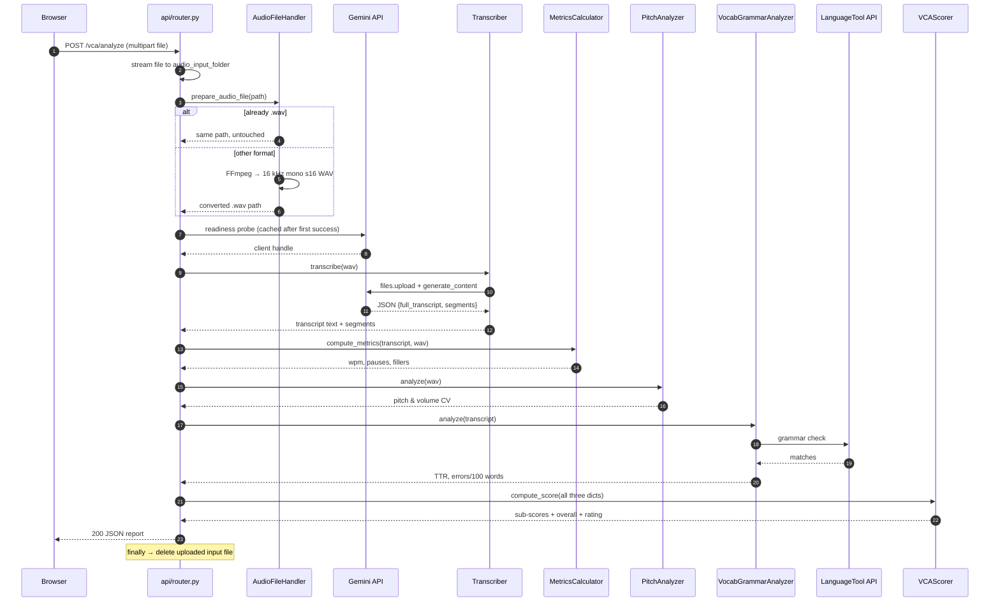

# 1. Architecture

## 1.1 What the system does

VCA accepts one audio recording per request and returns five sub-scores plus a
weighted overall score describing the speaker's verbal communication ability.

The design principle of this variant is **one cloud dependency for the hard
part, local computation for everything else**. Gemini does speech-to-text
(genuinely hard, needs a large model). Pace, pauses, pitch and volume are plain
signal processing done in-process with librosa. Grammar goes to the free
LanguageTool public API because running LanguageTool locally would require a
Java runtime, which serverless platforms do not provide.

## 1.2 Layers

```
┌──────────────────────────────────────────────────────────────────────┐
│  BROWSER                                                             │
│  frontend/index.html + script.js                                     │
│   · file picker  · MediaRecorder  · Web Audio 16 kHz mono WAV encode  │
└───────────────────────────────┬──────────────────────────────────────┘
                                │  multipart/form-data  POST /vca/analyze
┌───────────────────────────────▼──────────────────────────────────────┐
│  APPLICATION LAYER                                                   │
│  vca_code/main.py      FastAPI app, CORS, /static mount, /health      │
│  api/router.py         /vca/analyze orchestration, error mapping      │
└───────────────────────────────┬──────────────────────────────────────┘
                                │
┌───────────────────────────────▼──────────────────────────────────────┐
│  DOMAIN / PIPELINE LAYER  (vca_code/)                                │
│                                                                      │
│  AudioFileHandler ─► Transcriber ─┬─► MetricsCalculator              │
│                                   ├─► PitchAnalyzer                  │
│                                   └─► VocabGrammarAnalyzer           │
│                                              └─► VCAScorer           │
└───────────────────────────────┬──────────────────────────────────────┘
                                │
┌───────────────────────────────▼──────────────────────────────────────┐
│  CROSS-CUTTING                                                       │
│  Config (env + folders)   PipelineLogger (console + file)            │
│  GeminiReadinessChecker (pre-flight, cached client)                  │
└───────────────────────────────┬──────────────────────────────────────┘
                                │
┌───────────────────────────────▼──────────────────────────────────────┐
│  EXTERNAL                                                            │
│  Google Gemini API    ·    api.languagetool.org    ·    bin/ffmpeg    │
└──────────────────────────────────────────────────────────────────────┘
```

Every pipeline class follows the same shape, which makes the layer uniform and
easy to extend:

```python
class SomeAnalyzer:
    def __init__(self, config: Config, logger: PipelineLogger): ...
    def analyze(self, ...) -> dict: ...          # or compute_metrics / transcribe
    def save_metrics(self, metrics, base_filename) -> Path: ...
```

`Config` carries folder locations and credentials, `PipelineLogger` carries
numbered-step progress reporting, and every stage persists its own JSON
artifact keyed by the audio file's base name.

## 1.3 Request lifecycle



## 1.4 Pipeline stages in detail

| # | Stage | Module | Input | Output |
|---|-------|--------|-------|--------|
| 1 | Persist upload | `api/router.py` | `UploadFile` | file on disk |
| 2 | Validate / convert | `audio_utils.AudioFileHandler` | any audio path | 16 kHz mono WAV path |
| 3 | Readiness check | `gemini_readiness.GeminiReadinessChecker` | API key + model | live `genai.Client` |
| 4 | Transcribe | `transcription.Transcriber` | WAV | transcript text + timed segments |
| 5 | Pace / pause / filler | `metrics_calculator.MetricsCalculator` | transcript + WAV | `*_metrics.json` |
| 6 | Pitch / volume | `pitch_analyzer.PitchAnalyzer` | WAV | `*_pitch_metrics.json` |
| 7 | Vocab / grammar | `vocab_grammar_analyzer.VocabGrammarAnalyzer` | transcript | `*_vocab_metrics.json` |
| 8 | Score | `scorer.VCAScorer` | the three metric dicts | `*_score_report.json` |

Stages 5–7 are independent of one another — they only depend on stage 4 — so
they are a natural place to parallelise later. Today they run sequentially.

## 1.5 Why two transcript-independent paths exist

Note that stages 5 and 6 both read the WAV file, and stage 5 reads *both* the
WAV and the transcript. This is deliberate:

- **Word count** comes from the transcript. Gemini returns reliable text.
- **Timing** comes from the waveform, via `librosa.effects.split`. Gemini does
  *not* return reliable word-level timestamps, so the Azure variant's
  timestamp-based approach was replaced with silence detection. This is
  documented in the `MetricsCalculator` docstring.

So WPM is `transcript_word_count / audio_duration`, while pause statistics are
purely acoustic.

## 1.6 Data artifacts

For an upload named `interview.wav`, the run writes:

```
<runtime_root>/
├── audio_files/interview.wav              (deleted in the finally block)
├── transcript/interview_transcript.txt
├── json_output/interview_segments.json
├── json_output/interview_metrics.json
├── json_output/interview_pitch_metrics.json
├── json_output/interview_vocab_metrics.json
├── json_output/interview_score_report.json
└── log/vca_run_<YYYYMMDD_HHMMSS>.log
```

`<runtime_root>` is the project directory locally, and `/tmp/vca` on Vercel,
because the Vercel deployment filesystem is read-only. See
[06-configuration.md](06-configuration.md).

The HTTP response returns only the seven score fields — the JSON artifacts are
side-channel output for debugging and offline inspection, not part of the API
contract.

## 1.7 State and caching

The module level of `api/router.py` holds three pieces of process-global state:

```python
config = Config()                                         # folders, credentials
logger = PipelineLogger(log_folder=..., total_steps=8)    # one log file per process
CACHED_GEMINI_CLIENT = None                               # filled on first success
```

`get_gemini_client()` performs the readiness probe **once per process** and
caches the client. This matters because the probe itself costs a Gemini call,
and on a per-request basis that would double API usage and burn through
free-tier quota. It retries up to three times with 5 s and 10 s backoff when
Google returns `429` / `RESOURCE_EXHAUSTED`.

The consequence of process-global state on serverless: each cold start creates
a fresh log file and re-runs the readiness probe, while a warm container reuses
both. The logger's step counter is also global, so step numbers keep climbing
past `8/8` on the second and later requests served by the same container.

## 1.8 Error strategy

`api/router.py` wraps the pipeline in three guarded blocks and maps failures
onto HTTP status codes:

| Failure | Status | Behaviour |
|---|---|---|
| Audio could not be prepared | `400` | Uploaded file deleted, message explains the format problem |
| Gemini rate limit (readiness or pipeline) | `429` | Human-readable "wait and retry" message |
| Any other Gemini API error | `500` | Underlying message passed through |
| Anything else in the pipeline | `500` | `str(e)` passed through |

A `finally` block always deletes the uploaded input file and writes a
"Request Completed" banner to the log, so a failed request does not leave the
input lying around.

## 1.9 Two entrypoints

The repository contains two serverless entrypoints, and only one is wired up:

- **`vca_code/main.py`** — the real one. `vercel.json` names it as both the
  build source and the route destination. It bootstraps FFmpeg into `PATH`,
  fixes up `sys.path`, builds the `FastAPI` app, mounts `/static`, and includes
  the router.
- **`api/index.py`** — an alternative entrypoint for Vercel's filesystem-based
  Python routing. It sets `LTP_REMOTE_SERVER`, calls `static_ffmpeg.add_paths()`
  instead of using the bundled binary, patches `sys.path`, and re-exports
  `app` from `main`. It is **not referenced by `vercel.json`** and
  `static_ffmpeg` is **not in `requirements.txt`**, so importing it today would
  fail. See [09-known-issues.md](09-known-issues.md).

## 1.10 Design trade-offs worth knowing

| Decision | Benefit | Cost |
|---|---|---|
| Gemini for STT instead of a local model | No GPU, no model weights to ship, good accuracy, fillers preserved by prompt | Network dependency, per-request quota, cold-start latency |
| Silence detection instead of word timestamps | Works with any STT that returns only text | Pause counts depend on a fixed `top_db=30` threshold and so on recording quality |
| LanguageTool **remote** API | No Java runtime needed → deployable to serverless | Third-party rate limits; transcript text leaves the deployment |
| In-browser WAV encoding | Server needs no FFmpeg for the normal path; smaller uploads | Depends on `AudioContext`/`OfflineAudioContext` support |
| Bundled static FFmpeg binary | Non-WAV uploads work without system packages | ~76 MB in the repository and in the deployment bundle |
| JSON artifacts per stage | Each stage is independently testable and debuggable | Writes accumulate in `/tmp` on serverless |
