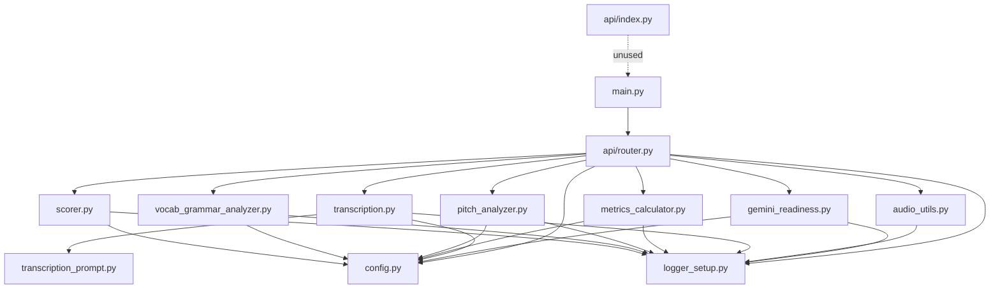

# 2. Module reference

Every module in `VCA/vca-without-azure/`, class by class and method by method.

---

## 2.1 `vca_code/config.py` — `Config`

Centralised configuration loader. Reads a `.env` file, derives the folder
layout, creates the folders, and fails fast if credentials are missing.

### Constructor

```python
Config(env_path: str = None)
```

If `env_path` is omitted it defaults to `<project_root>/.env`, where
`project_root` is `vca_code/`'s parent, i.e. `VCA/vca-without-azure/`.
`python-dotenv` loads that file into the process environment.

### Attributes

| Attribute | Type | Source | Default |
|---|---|---|---|
| `gemini_api_key` | `str` | `GEMINI_API_KEY` | `""` (then validation fails) |
| `gemini_model` | `str` | `GEMINI_MODEL` | `"gemini-2.5-flash"` |
| `project_root` | `Path` | derived | `VCA/vca-without-azure/` |
| `runtime_root` | `Path` | derived | `/tmp/vca` if `VERCEL` is set, else `project_root` |
| `audio_input_folder` | `Path` | derived | `runtime_root/audio_files` |
| `transcript_folder` | `Path` | derived | `runtime_root/transcript` |
| `json_output_folder` | `Path` | derived | `runtime_root/json_output` |
| `log_folder` | `Path` | derived | `runtime_root/log` |

### The `runtime_root` split

```python
if os.environ.get("VERCEL"):
    self.runtime_root = Path("/tmp/vca")
else:
    self.runtime_root = self.project_root
```

This is the single most important line for serverless correctness. Vercel
deploys the application onto a read-only filesystem; only `/tmp` is writable.
Without this branch, `_ensure_folders_exist()` would raise on every cold start.
`VERCEL` is set automatically by the platform, so no manual configuration is
needed.

### Private methods

- **`_ensure_folders_exist()`** — `mkdir(parents=True, exist_ok=True)` over all
  four folders. Idempotent, safe to call repeatedly.
- **`_validate()`** — currently requires only `GEMINI_API_KEY`. Raises
  `EnvironmentError` listing every missing key. Because this runs in
  `__init__`, and `api/router.py` instantiates `Config()` at import time, a
  missing key fails the whole application at startup rather than at first
  request — deliberate fail-fast behaviour.

---

## 2.2 `vca_code/logger_setup.py` — `PipelineLogger`

A thin wrapper over `logging` that writes to stdout and to a timestamped file
simultaneously, plus a numbered-step helper for progress reporting.

```python
PipelineLogger(log_folder: Path, total_steps: int = 10)
```

### Behaviour

- Log file: `<log_folder>/vca_run_<YYYYMMDD_HHMMSS>.log`, UTF-8.
- Format: `%(asctime)s | %(levelname)s | %(message)s`, timestamps
  `%Y-%m-%d %H:%M:%S`.
- Uses the named logger `"VCA_Pipeline"` and calls `handlers.clear()` first, so
  re-instantiating does not duplicate output. Note the side effect: a second
  `PipelineLogger` detaches the first one's file handler, because both share the
  same underlying named logger.
- Level is `INFO`; there is no `DEBUG` path.

### Methods

| Method | Effect |
|---|---|
| `step(description)` | Increments `current_step`, logs `[STEP n/total] description` |
| `info(msg)` / `warning(msg)` / `error(msg)` | Straight pass-through |
| `get_log_file_path()` | Returns the `Path` of this run's log file |

`step()` is called once by each pipeline stage, so a single request walks
through roughly seven of the eight declared steps. Because the instance in
`api/router.py` is module-global, the counter is **cumulative across requests**
in a warm process and will report `[STEP 14/8]` on the second request. Cosmetic,
but confusing when reading logs.

---

## 2.3 `vca_code/gemini_readiness.py` — `GeminiReadinessChecker`

Pre-flight validation that the Gemini credentials and model actually work,
before the pipeline spends time on audio handling.

```python
GeminiReadinessChecker(config: Config, logger: PipelineLogger)
```

### Import strategy

The module tries three import paths in turn — `vca_code.config`, then bare
`config`, then `app.services.config`. This tolerates being imported as a
package, as a flat `sys.path` entry (how the serverless entrypoints set things
up), or from an older service layout.

### `check_all() -> bool`

Runs a list of `(name, callable)` checks, logging `✓` or `✗` per check, and
returns `True` only if all passed. Today the list holds one entry, "Gemini API
key validity" — the structure exists so more checks can be appended without
touching the control flow.

Note that `check_all()` catches exceptions per check and converts them into a
`False` return, so callers see a boolean rather than the original exception.

### `_check_gemini_api()`

```python
self.client = genai.Client(api_key=self.config.gemini_api_key)
response = self.client.models.generate_content(
    model=self.config.gemini_model,
    contents="Reply with exactly one word: OK",
    config=types.GenerateContentConfig(temperature=0.0),
)
```

Deliberately the smallest possible real call: one-word output,
`temperature=0.0`. It proves three things at once — the key is valid, the model
name exists, and the network path is open. Raises `RuntimeError` on an empty
response.

The important side effect: **`self.client` is the client the rest of the
pipeline reuses.** `Transcriber` receives it rather than constructing its own,
so there is exactly one client per process.

---

## 2.4 `vca_code/audio_utils.py` — `AudioFileHandler`

Validates the uploaded file and converts it to the canonical format when
necessary.

```python
AudioFileHandler(logger: PipelineLogger)
```

### Constants

| Constant | Value | Meaning |
|---|---|---|
| `TARGET_SAMPLE_RATE` | `16000` | 16 kHz — standard for speech models |
| `TARGET_CHANNELS` | `1` | Mono |

### FFmpeg discovery

The constructor calls `shutil.which("ffmpeg")` and stores the result, logging
either the resolved path or a notice that WAV-only processing is available. It
deliberately **does not raise** when FFmpeg is absent, because that would break
application startup on platforms that have no FFmpeg — the failure is deferred
to the one case that actually needs it.

### `prepare_audio_file(input_path: Path) -> Path`

1. Raise `FileNotFoundError` if the path does not exist.
2. If the suffix is `.wav` (case-insensitive), **return the path unchanged.**
3. Otherwise, if FFmpeg is unavailable, raise `EnvironmentError` telling the
   caller to upload WAV instead.
4. Otherwise delegate to `_convert_to_wav`.

Worth being explicit about step 2: an incoming `.wav` is **not** re-encoded, so
its sample rate and channel count are whatever the client sent. The browser UI
compensates by always encoding to 16 kHz mono itself. A WAV uploaded by other
means (curl, Postman) at 44.1 kHz stereo will be analysed as-is. librosa loads
with `sr=None`, so the DSP stages respect the real rate and still produce valid
numbers — but they will not be directly comparable to 16 kHz runs.

### `_convert_to_wav(input_path: Path) -> Path`

Invokes FFmpeg via `subprocess.run(..., capture_output=True, text=True)`:

```
ffmpeg -y -i <input> -ar 16000 -ac 1 -sample_fmt s16 <input-with-.wav-suffix>
```

Raises `RuntimeError` including FFmpeg's stderr on a non-zero exit code. The
output path is `input_path.with_suffix(".wav")`, i.e. alongside the input.

---

## 2.5 `vca_code/transcription_prompt.py`

A single constant, `TRANSCRIPTION_PROMPT`. Three things it does deliberately:

1. Asks for a complete, word-for-word transcript.
2. **Explicitly asks for filler words** (`"um"`, `"uh"`, `"like"`) to be kept.
   Most STT systems silently remove these; the filler score depends entirely on
   them surviving.
3. Requests strict JSON with `full_transcript` and a `segments` array of
   `{start_time, end_time, text}` in `MM:SS`.

---

## 2.6 `vca_code/transcription.py` — `Transcriber`

```python
Transcriber(config: Config, logger: PipelineLogger, client: genai.Client)
```

### `transcribe(wav_file_path) -> tuple[str, list]`

1. `client.files.upload(file=str(wav_file_path))` — uploads to Gemini's file
   store.
2. `client.models.generate_content(model=..., contents=[uploaded_file, PROMPT])`.
3. Parses via `_parse_response`.
4. Warns if the transcript is blank; logs the word count.

Note: uploaded files are never deleted from Gemini's file store, so they
accumulate against the account's storage.

### `_parse_response(response_text) -> tuple[str, list]`

Gemini often wraps JSON in markdown fences despite the instruction, so the
parser strips backticks and a leading `json` label before `json.loads`. On
`JSONDecodeError` it logs a warning and falls back to **treating the raw
response text as the transcript** with an empty segment list. That fallback is
what keeps a malformed model response from failing the whole request — the
scores still compute, only the segment timings are lost.

### Persistence

| Method | Writes |
|---|---|
| `save_transcript(text, base)` | `transcript/<base>_transcript.txt`, UTF-8 |
| `save_segments(segments, base)` | `json_output/<base>_segments.json`, indent 2 |

---

## 2.7 `vca_code/metrics_calculator.py` — `MetricsCalculator`

Computes pace, pause and filler metrics by combining transcript word counts
with acoustic silence detection.

### Constants

| Constant | Value | Meaning |
|---|---|---|
| `FILLER_WORDS` | set of 11 entries | `um, uh, umm, uhh, like, you know, actually, basically, literally, so` |
| `TOP_DB` | `30` | dB below peak treated as silence by `librosa.effects.split` |
| `PAUSE_THRESHOLD_SEC` | `0.3` | Gaps longer than this count as a pause |
| `LONG_PAUSE_THRESHOLD_SEC` | `1.5` | Pauses longer than this are "long" |

Two caveats about `FILLER_WORDS`. The tokeniser is
`re.findall(r"\b[a-zA-Z']+\b", text.lower())`, which emits single words, so the
multi-word entry `"you know"` can never match. And `like` and `so` are counted
unconditionally, including in legitimate uses ("I would like to", "so the
array…"), which inflates the filler count on technical speech.

### `compute_metrics(transcript_text, wav_file_path) -> dict`

1. Tokenise the transcript; return `{}` immediately if there are no words.
2. `librosa.load(path, sr=None)` — native sample rate preserved.
3. `librosa.get_duration` → `total_duration_sec`.
4. `librosa.effects.split(y, top_db=30)` → non-silent intervals.
5. `_compute_pauses` → gap durations above the threshold.
6. Derive the metrics below.

```
speaking_time      = total_duration − Σ pauses
wpm                = total_words / total_duration × 60
articulation_rate  = total_words / speaking_time  × 60
filler_ratio       = filler_count / total_words   × 100
```

### Output schema

```json
{
  "total_words": 412,
  "total_duration_sec": 183.42,
  "wpm": 134.8,
  "articulation_rate": 152.1,
  "num_pauses": 19,
  "total_pause_time": 20.11,
  "avg_pause_duration": 1.06,
  "long_pauses": 4,
  "filler_count": 9,
  "filler_ratio": 2.2
}
```

`wpm` includes pause time; `articulation_rate` excludes it. The scorer uses
`wpm` only — `articulation_rate` is reported for diagnostics.

### `_compute_pauses(non_silent_intervals, sr) -> list`

Walks consecutive non-silent intervals and records
`(next_start − prev_end) / sr` where it exceeds `PAUSE_THRESHOLD_SEC`. Only
*internal* gaps count — leading and trailing silence is excluded by
construction, which is the right behaviour for a recording that starts or ends
with dead air.

### Persistence

`save_metrics(metrics, base)` → `json_output/<base>_metrics.json`.

---

## 2.8 `vca_code/pitch_analyzer.py` — `PitchAnalyzer`

Entirely local DSP: fundamental frequency and loudness variability. No external
service.

### Constants

| Constant | Value | Meaning |
|---|---|---|
| `FMIN_NOTE` | `"C2"` | ≈65 Hz, the floor of the PYIN search |
| `FMAX_NOTE` | `"C7"` | ≈2093 Hz, the ceiling |

That range comfortably brackets adult speaking pitch for all voices, which is
why it is set generously rather than tuned per speaker.

### `analyze(wav_file_path) -> dict`

Loads the audio once with `sr=None`, then merges the results of the two private
analysers.

### `_analyze_pitch(y, sr) -> dict`

Uses `librosa.pyin` — probabilistic YIN — which returns `f0` with `NaN` at
unvoiced frames. Those frames are filtered out with `~np.isnan(f0)`. If nothing
voiced remains, it logs a warning about recording quality and returns all
zeros rather than raising.

```
pitch_range_hz   = max(f0) − min(f0)
pitch_cv_percent = std(f0) / mean(f0) × 100
```

The **coefficient of variation** is the key number: it normalises variability
by the speaker's own average pitch, so a bass voice and a soprano voice with
equally lively intonation score the same. That is precisely what you want for a
fairness-sensitive metric.

Returns `mean_pitch_hz`, `std_pitch_hz`, `pitch_range_hz`, `pitch_cv_percent`.

### `_analyze_volume(y) -> dict`

`librosa.feature.rms(y=y)[0]` → per-frame RMS energy, then
`volume_cv_percent = std / mean × 100`. Returns `mean_volume` (4 decimals) and
`volume_cv_percent`.

### Persistence

`save_metrics(metrics, base)` → `json_output/<base>_pitch_metrics.json`.

---

## 2.9 `vca_code/vocab_grammar_analyzer.py` — `VocabGrammarAnalyzer`

Grammar correctness and lexical richness.

### Constructor and the remote-server decision

```python
self.tool = language_tool_python.LanguageTool(
    'en-US', remote_server='https://api.languagetool.org'
)
```

`language_tool_python` would otherwise download and run LanguageTool locally,
which needs a JVM. Serverless Python runtimes have no JVM, so the remote public
API is used instead. Construction is wrapped in `try/except`: a failure sets
`self.tool = None` and logs a warning rather than raising, so the pipeline
degrades to "no grammar errors found" instead of failing the request.

### `analyze(transcript_text) -> dict`

Returns `{}` for a blank transcript. Otherwise runs `_check_grammar` and
`_analyze_vocabulary`, merges them, and adds:

```
errors_per_100_words = grammar_error_count / total_words × 100
```

Individual grammar issues are logged line by line as `rule_id: message`, which
is useful for inspecting *why* a transcript scored badly.

### `_check_grammar(text) -> tuple[int, list]`

Returns `(0, [])` when `self.tool` is `None` or when the remote call raises.
This is a deliberate graceful degradation, but note the scoring consequence:
a LanguageTool outage produces **zero errors**, which the scorer rewards with
the maximum grammar sub-score of 100. A grammar failure therefore inflates the
score rather than failing visibly.

### `_analyze_vocabulary(text) -> dict`

```
total_words      = len(tokens)
unique_words     = len(set(tokens))
ttr              = unique_words / total_words        # Type-Token Ratio
avg_word_length  = Σ len(token) / total_words
```

TTR is sensitive to transcript length — longer speech inevitably repeats
function words, so TTR falls as duration rises. The scorer's TTR band
(`0.5–0.75`) implicitly assumes a short sample, a few minutes at most.

### `close()`

Releases the LanguageTool handle, swallowing any error. `api/router.py` calls
it right after `save_metrics`.

### Persistence

`save_metrics(metrics, base)` → `json_output/<base>_vocab_metrics.json`.

---

## 2.10 `vca_code/scorer.py` — `VCAScorer`

Turns raw metrics into 0–100 sub-scores and a weighted composite. Full rubric
with thresholds and a worked example is in
[04-scoring-methodology.md](04-scoring-methodology.md); this section covers the
code shape only.

### Weights

```python
WEIGHTS = {
    "pace": 0.20, "fluency": 0.25, "filler": 0.15,
    "expressiveness": 0.20, "vocab_grammar": 0.20,
}
```

Sums to exactly 1.00, so the composite is bounded by the sub-scores' own range.

### `compute_score(metrics, pitch_metrics, vocab_metrics) -> dict`

Reads every input through `.get(key, 0)`, which makes it tolerant of the empty
dicts that upstream stages return for blank transcripts — but also means a
blank transcript still yields a score rather than an error. Produces:

```json
{
  "pace_score": 100.0, "fluency_score": 80.0, "filler_score": 100.0,
  "expressiveness_score": 94.0, "vocab_grammar_score": 90.0,
  "overall_score": 92.3, "rating": "Excellent"
}
```

### Scoring methods

| Method | Input | Shape |
|---|---|---|
| `_score_pace(wpm)` | WPM | Step bands, 100/80/60/40 |
| `_score_fluency(num_pauses, long_pauses, duration)` | pause stats | Band on pauses/min, minus `10 × long_pauses`, floored at 0 |
| `_score_filler_words(filler_ratio)` | % | Step bands, 100/80/60/40/20 |
| `_score_expressiveness(pitch_cv, volume_cv)` | two CVs | Continuous, 0.6/0.4 blend |
| `_score_vocab_grammar(ttr, errors_per_100)` | TTR + error rate | 50/50 blend of two band scores |
| `_rating_label(score)` | overall | `Excellent / Good / Fair / Needs Improvement` |

`_score_expressiveness` is the only continuous scorer. Its inner helper rewards
a target window and decays outside it, asymmetrically — monotone delivery
(below the window) is punished three times harder per point than excessive
variation (above it), and both are floored at 30:

```python
def sub_score(cv, low, high):
    if low <= cv <= high:   return 100
    elif cv < low:          return max(30, 100 - (low - cv) * 3)
    else:                   return max(30, 100 - (cv - high) * 1.5)
```

Note the class docstring says "the four metric dimensions" and then lists five;
there are five.

### Persistence

`save_report(report, base)` → `json_output/<base>_score_report.json`.

---

## 2.11 `vca_code/main.py` — application bootstrap

Runs in a strict order, because each block depends on the previous one.

**1. Environment.** `os.environ["LTP_REMOTE_SERVER"] = "https://api.languagetool.org"`
is set before any import of `language_tool_python`, which reads it at import
time.

**2. Base directory resolution.**

```python
BASE_DIR = Path(__file__).resolve().parent.parent
if not (BASE_DIR / "bin").exists():
    BASE_DIR = Path(os.getcwd())
```

The fallback exists because Vercel's bundling can place `includeFiles` content
relative to the working directory rather than the source file.

**3. FFmpeg bootstrap.** If `BASE_DIR/bin/ffmpeg` exists, add the execute bit
(wrapped in `try/except` because the deployment filesystem is read-only, in
which case a notice is printed and execution continues), then prepend
`BASE_DIR/bin` to `PATH` so `shutil.which("ffmpeg")` finds it later.

**4. `sys.path` patching.** Inserts `BASE_DIR`, `vca_code/` and `api/` so the
flat imports (`from config import Config`) resolve under every entrypoint.

**5. FastAPI app.** Title "Verbal Communication Ability (VCA) API", version
`1.0.0`.

**6. CORS.** `allow_origins=["*"]` with `allow_credentials=True`,
`allow_methods=["*"]`, `allow_headers=["*"]`. Note that browsers reject the
wildcard-plus-credentials combination, so credentialed cross-origin requests
will fail; see [09-known-issues.md](09-known-issues.md).

**7. Static mount.** `/static` → `frontend/`, only if the folder exists.

**8. Router.** `from router import router as vca_router`, falling back to
`from api.router import ...` on `ModuleNotFoundError` — covering both the flat
`sys.path` layout and package-relative imports.

**9. Routes.** `GET /` serves `frontend/index.html`, or a JSON status object if
the frontend is missing. `GET /health` returns
`{"status": "healthy", "service": "VCA API"}`.

**10. Local run guard.** `uvicorn.run("main:app", host="0.0.0.0", port=8000, reload=True)`
under `if __name__ == "__main__"`, so importing the module as a serverless
handler never starts a server.

---

## 2.12 `api/router.py` — the orchestrator

Covered functionally in [01-architecture.md](01-architecture.md#13-request-lifecycle)
and as an HTTP contract in [03-api-reference.md](03-api-reference.md). Structural
notes:

- `APIRouter(prefix="/vca", tags=["VCA"])` — every route is under `/vca`, and
  the tag groups them in the OpenAPI UI.
- Module-level `config`, `logger` and `CACHED_GEMINI_CLIENT`, discussed in
  [01-architecture.md §1.7](01-architecture.md#17-state-and-caching).
- `get_gemini_client()` — cached readiness probe with retry/backoff
  (`max_retries = 3`, `retry_delays = [5, 10]`). Retries on `429` /
  `RESOURCE_EXHAUSTED` and on generic exceptions; raises `RuntimeError` after
  exhausting attempts.
- `analyze_audio(file: UploadFile)` — the four-block structure (save, readiness,
  pipeline, cleanup) described in the architecture doc.

One behaviour to be aware of when reading the cleanup code: the `finally` block
deletes `uploaded_path`, the *original* upload. When FFmpeg converted a non-WAV
input, the derived `.wav` has a different path and is **not** deleted, so it
stays in `audio_files/` along with every transcript and JSON artifact.

---

## 2.13 `api/index.py` — alternative entrypoint

Not referenced by `vercel.json`. Sets `LTP_REMOTE_SERVER`, calls
`static_ffmpeg.add_paths()` to pull FFmpeg from the `static-ffmpeg` package
instead of the bundled binary, patches `sys.path` with `vca_code/` and `api/`,
and re-exports `app` from `main`.

`static_ffmpeg` is **not** declared in `VCA/requirements.txt`, so this module
cannot currently be imported successfully. See
[09-known-issues.md](09-known-issues.md).

---

## 2.14 `api/__init__.py`

Empty. Marks `api/` as a package so `from api.router import router` works.

---

## 2.15 Module dependency graph



`config.py` and `logger_setup.py` are leaves — they import nothing from the
project. Every other module depends on them, and nothing creates a cycle.
