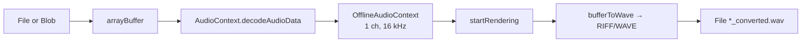

# 5. Frontend

A deliberately dependency-free single page: three files, no build step, no
framework, no package manager. `index.html` (115 lines), `style.css`
(324 lines), `script.js` (~250 lines).

Served by FastAPI itself — `GET /` returns `index.html`, and `/static` is
mounted onto the `frontend/` folder, which is why the markup references
`/static/style.css` and `/static/script.js` with absolute paths.

---

## 5.1 Layout

```
┌───────────────┬──────────────────────────────────────────────────┐
│               │  ┌────────────────────────────────────────────┐  │
│   SIDEBAR     │  │ [ Upload Media ] [ Record Audio ]          │  │
│               │  │                                            │  │
│   VCA         │  │   ┌──────────────────────────────────┐     │  │
│   VERBAL      │  │   │  drop zone / recorder            │     │  │
│   COMM.       │  │   └──────────────────────────────────┘     │  │
│   ANALYZER    │  │        [ ⚡ Analyze Audio ]                 │  │
│               │  │   ┌──── status banner (hidden) ──────┐     │  │
│               │  └────────────────────────────────────────────┘  │
│               │  ┌────────────────────────────────────────────┐  │
│               │  │  Analysis Results                          │  │
│               │  │     ┌─ Overall Performance ─┐              │  │
│               │  │     │     Excellent          │              │  │
│               │  │     │     Score: 86.5/100    │              │  │
│               │  │     └────────────────────────┘              │  │
│               │  │  [Pace] [Fluency] [Filler] [Expr.] [Vocab] │  │
│               │  └────────────────────────────────────────────┘  │
└───────────────┴──────────────────────────────────────────────────┘
```

Visibility is managed entirely with a single `.hidden` CSS class toggled by
`classList.add` / `classList.remove`. There is no client-side router and no
template engine — every element exists in the DOM from first paint and is
shown or hidden.

---

## 5.2 The two input modes

Tab switching is four lines of class toggling on `#tabUploadBtn` /
`#tabRecordBtn` and their `.tab-content` panels.

### Upload Media

`<input type="file" accept="audio/*, video/*" hidden>` driven by a styled
`<label for="audioFile">`, which is the standard trick for replacing the browser's
default file-input chrome. On `change`, the handler stores the `File`, displays
name and size in MB to two decimals, and enables the analyse button.

The subtitle advertises MP4, MP3, WAV, OGG and M4A. Since everything is
re-encoded client-side, the real constraint is whatever the browser's
`decodeAudioData` can decode.

### Record Audio

Uses `MediaRecorder` over `navigator.mediaDevices.getUserMedia({ audio: true })`.

- `ondataavailable` accumulates chunks into `audioChunks`.
- `onstop` assembles an `audio/webm` blob, shows an encoding status, converts it
  to 16 kHz mono WAV, and wires the result to three places: an `<audio controls>`
  preview, a download link (`recorded_audio.wav`), and the analyse button.
- A `setInterval` timer renders `MM:SS` with zero padding.
- Stopping explicitly calls `stream.getTracks().forEach(t => t.stop())`, which
  releases the microphone and clears the browser's recording indicator — easy
  to forget, and visible to users when it is forgotten.
- `getUserMedia` rejection (permission denied, insecure origin, unsupported
  browser) is caught and surfaced via `alert`.

Microphone access requires a secure context: `https://` or `localhost`.

---

## 5.3 In-browser WAV encoding

The most substantial piece of frontend logic, and the reason the backend can run
without FFmpeg.



### `convertToWav(file)`

1. `file.arrayBuffer()`.
2. `new (window.AudioContext || window.webkitAudioContext)()` then
   `decodeAudioData` — the browser's own codecs handle MP3, M4A, OGG, WebM and
   the audio track of MP4.
3. Build an `OfflineAudioContext(1, duration × 16000, 16000)`. Constructing the
   offline context at the target rate is what performs the resample and the
   downmix to mono — the browser's resampler does the work, not hand-written
   code.
4. `startRendering()` → a mono 16 kHz `AudioBuffer`.
5. `bufferToWave()` serialises it.
6. Return a `File` named `<original>_converted.wav`.

This is why the `filename` in API responses usually ends in `_converted.wav`.

### `bufferToWave(abuffer)`

Writes a 44-byte canonical RIFF/WAVE header by hand through a `DataView`, all
fields little-endian, then interleaves channels as signed 16-bit PCM:

| Offset | Field | Value |
|---|---|---|
| 0 | ChunkID | `"RIFF"` |
| 4 | ChunkSize | `length − 8` |
| 8 | Format | `"WAVE"` |
| 12 | Subchunk1ID | `"fmt "` |
| 16 | Subchunk1Size | 16 |
| 20 | AudioFormat | 1 (PCM) |
| 22 | NumChannels | from the buffer |
| 24 | SampleRate | from the buffer |
| 28 | ByteRate | `sampleRate × 2 × channels` |
| 32 | BlockAlign | `channels × 2` |
| 34 | BitsPerSample | 16 |
| 36 | Subchunk2ID | `"data"` |
| 40 | Subchunk2Size | remaining bytes |
| 44… | Samples | interleaved signed 16-bit |

Samples are clamped to `[-1, 1]` before scaling, which prevents wrap-around
distortion on any sample that exceeded full scale during decoding.

### `convertBlobToWav(blob)`

Wraps a recorder blob in a `File` named `recorded_audio.webm` and delegates to
`convertToWav`, so recording and upload share exactly one encoding path.

---

## 5.4 Submission

`processAndSendFile(file, buttonElement)` is the single submit path for both
tabs.

```javascript
if (fileExt !== 'wav')          fileToSend = await convertToWav(file);
else if (fileSizeMB > 3.0)      fileToSend = await convertToWav(file);
```

Two conversion triggers:

- **Not a WAV** → convert, because the server may have no FFmpeg.
- **A WAV over 3 MB** → convert anyway, to shrink it. A large WAV is almost
  always high sample rate or stereo; re-encoding to 16 kHz mono typically cuts
  it by 4–6×. The threshold exists to stay under the serverless request body
  limit.

Then:

```javascript
const formData = new FormData();
formData.append("file", fileToSend);
const response = await fetch("/vca/analyze", { method: "POST", body: formData });
if (!response.ok) throw new Error(`Server returned status: ${response.status}`);
```

The URL is relative, so the page works unchanged on localhost and on any
deployed host.

Throughout, the button is disabled and relabelled `⏳ Analyzing...`, and a
`finally` block restores it. Note that the restore sets the label to
`⚡ Analyze Audio` for both buttons, so the record tab's button loses its
original `⚡ Analyze Recorded Audio` text after the first run.

### Status messages

A single `#statusBox` banner is driven by `showStatus(msg)`:

| Message | When |
|---|---|
| `⚙️ Encoding audio to 16kHz .wav format...` | After recording stops |
| `🔄 Converting <EXT> file to .wav...` | Non-WAV upload |
| `📉 Compressing N MB .wav to under 3 MB...` | Oversized WAV |
| `⚡ Processing analysis... Please wait.` | Request in flight |
| `❌ Error during processing: <message>` | Any failure |

### Error handling

Failures produce both a status banner and an `alert`. The two paths differ in
what they report:

- A non-`2xx` response surfaces only the numeric status
  (`Server returned status: 429`). The `detail` string from the server — which
  is the part explaining *what to do* — is never read.
- A `200` whose body is not `status === "success"` triggers
  `"Analysis failed. Please check logs."`, which users cannot act on.

Parsing `detail` out of the response body and showing it would make the
`429` "wait a minute and retry" message actually reach the person who needs it.

---

## 5.5 Rendering results

```javascript
function displayResults(data) {
  const report = data.report;
  document.getElementById('resFileName').textContent          = data.filename;
  document.getElementById('ratingBadgeText').textContent      = report.rating || "Excellent";
  document.getElementById('overallScore').textContent         = report.overall_score;
  document.getElementById('paceScore').textContent            = report.pace_score;
  document.getElementById('fluencyScore').textContent         = report.fluency_score;
  document.getElementById('fillerScore').textContent          = report.filler_score;
  document.getElementById('expressivenessScore').textContent  = report.expressiveness_score;
  document.getElementById('vocabScore').textContent           = report.vocab_grammar_score;
  resultsSection.classList.remove('hidden');
}
```

The rating is shown large, with the numeric score as a smaller sub-line — the
markup comments this as intentional ("Highlighting Rating Text over Numeric
Score"). Each of the five metric boxes pairs an inline SVG icon with a label and
value; the icons are inline rather than linked so the page needs no image
requests.

One thing to flag: `report.rating || "Excellent"` falls back to the *best*
rating when the field is missing or empty. A falsy rating would display
"Excellent" next to whatever the real score is. `"—"` would be the safer
default.

Using `textContent` everywhere (never `innerHTML`) means the server-echoed
filename cannot inject markup — the right choice, since `filename` is
client-controlled and echoed back verbatim.

---

## 5.6 DOM contract

The script resolves every element by ID at load time, so renaming any of these
in `index.html` breaks the page silently.

| ID | Role |
|---|---|
| `tabUploadBtn`, `tabRecordBtn` | Tab buttons |
| `tabUploadContent`, `tabRecordContent` | Tab panels |
| `audioFile` | Hidden file input |
| `dropZone` | Upload drop area |
| `fileInfo`, `fileName`, `fileSize` | Selected-file readout |
| `btnAnalyzeUpload` | Submit (upload tab) |
| `btnStartRecord`, `btnStopRecord` | Recorder controls |
| `recordTimer` | `MM:SS` display |
| `audioPreview` | `<audio controls>` playback |
| `recordInfo`, `recordFileName` | Recorded-file readout |
| `btnDownloadRecord` | Download link for the encoded WAV |
| `btnAnalyzeRecord` | Submit (record tab) |
| `statusBox`, `statusText` | Status banner |
| `resultsSection`, `resFileName` | Results card |
| `ratingBadgeText`, `overallScore` | Overall badge |
| `paceScore`, `fluencyScore`, `fillerScore`, `expressivenessScore`, `vocabScore` | Metric values |

`#dropZone` carries the drop-zone styling but **no `dragover`/`drop` handlers
are registered** — the area looks droppable and is not. Only the "Browse File"
label works. Adding the two listeners would be a small, self-contained
improvement.

---

## 5.7 Browser requirements

| Feature | Needed for |
|---|---|
| `MediaRecorder` | Recording |
| `navigator.mediaDevices.getUserMedia` | Microphone access (secure context only) |
| `AudioContext` / `webkitAudioContext` | Decoding |
| `OfflineAudioContext` | Resampling to 16 kHz mono |
| `fetch`, `FormData`, `async`/`await` | Submission |
| `File`, `Blob`, `ArrayBuffer`, `DataView` | WAV encoding |

All are long-standing in current Chrome, Firefox, Safari and Edge. There is no
feature detection beyond the `webkitAudioContext` alias and the `getUserMedia`
`try/catch`, so an unsupported browser fails at the point of use rather than up
front.

---

## 5.8 Extending the UI

The server already computes far more than it returns. Showing WPM, pause counts,
TTR, mean pitch or the grammar rule hits requires:

1. Widening the response in `api/router.py` to include the raw metric dicts.
2. Adding elements and a `displayResults` assignment per field.

The pieces for a richer report are mostly in place. The segment timings from
`transcription.py` (`{start_time, end_time, text}`) are already persisted and
would drive a transcript view with a timeline — currently they are written to
`json_output/` and never surfaced.
